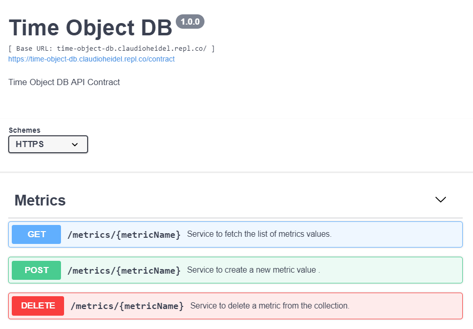

# time-object-db

Welcome to timeObjectsDB

## Objective:

Develop an file based DB in order to store any Objects type correlated to the epoc date time.
The main features of this DB are:
- Store Objects into metrics.
- Fetch metrics Objects from a windows time (betweeen fromEpoc and toEpoc)
- Delete Objects from an specific metric.

## Solution:

timeObjectsDB use single files in order to persist the information splited in three levels:

- Level 1: YYYY-MM (Max 12 folders per year)
- Level 2: DD (Max 365 folders per parent)
- Level 3: One file each 5 minutes - (Max 144 files per parent) (configurable) 

Exist an index file per each Level 2 folder, this index help to find existing Level 3 files and prevent to use a full-scan to find the existing files.
  
## Real time examples

API Contract: https://editor.swagger.io/?url=https://time-object-db.claudioheidel.repl.co/contract

Online Demo: https://time-object-db.claudioheidel.repl.co

Author: Claudio Heidel Schemberger - https://www.linkedin.com/in/mrcheidel/

