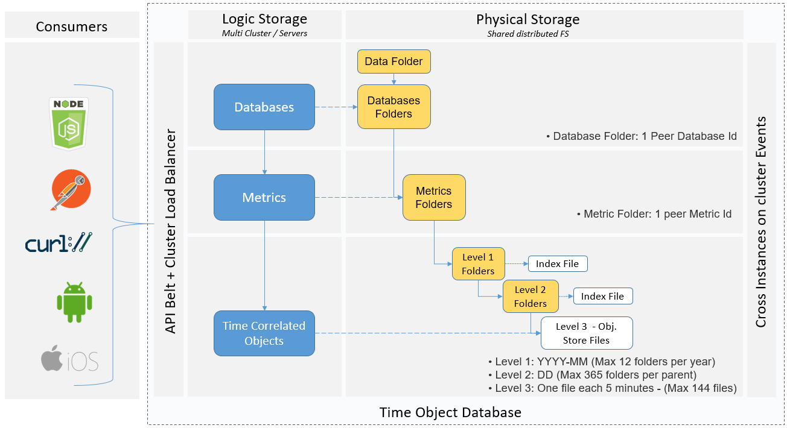
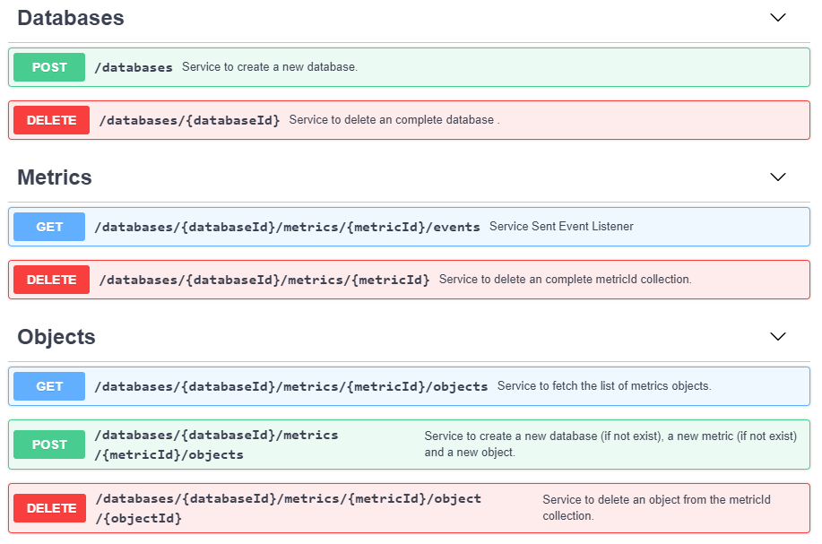

<link rel="stylesheet" type="text/css" media="all" href="doc/style.css" />

# Welcome to time-object-db 

Current version: 1.0.7

## Challenge:

The challenge was to create a persistence system to store objects correlated with the date-time for later use without the need to install and maintain an exclusive service (external databases).

This persistence system need to have a quickly search feature, for this reason we use binary tree and cascading indexes.

At the same time this solution should be easy to deploy in cloud services such as the AWS Lambda functions (high availability and auto scaling).

The main features of the time-object-db are:
- Create and delete databases
- Create metrics collections and store objects.
- Fetch metric objects from a period time (between fromEpoc and toEpoc).
- Delete metric objects from a specific time value.
- Complete clean a metric collection

## Solution:



time-object-db use single files in order to persist the information splitted in three levels:

- Level 1: YYYY-MM (Max 12 folders per year)
- Level 2: DD (Max 365 folders per parent)
- Level 3: One file each 5 minutes - (Max 144 files per parent) (configurable) 

Exist an index file per each Level 1 and 2 folders, these indexes help to find existing Level 3 files and prevent to use a full-scan to find the existing files.

## How to Scale:
  


## Events:

This database emit 7 events

- database/{databaseId}/database-delete    => When a database is deleted
- database/{databaseId}/metric-delete/{metridId} => When a metric is deleted
- database/{databaseId}/index/{metridId}   => When a index is updated or created
- database/{databaseId}/delete/{metridId}  => When an object is deleted
- database/{databaseId}/insert/{metridId}  => When a new object is inserted
- database/{databaseId}/read/{metridId}    => When a new query has been executed.

### Development notes:

time-object-db is developed using only **[node.js](https://nodejs.org/)**

I'm developing this project in my free time from different places. For this reason, I use **[Repl.it](https://repl.it/)**, an online coding platform that allows me continue working regardless where I'm.

### How to install


```bash
mkdir test-folder
cd test-folder
git clone https://github.com/mrcheidel/time-object-db.git
cd time-object-db
npm install
node index.js
```

### How to use - From Node.js: 

[Run this demo](https://repl.it/@ClaudioHeidel/todb-js)

```bash
const toDb = require ("./todb.js");

const metricId = 'myMetricId';
//Declare some object to insert
const myObj1 =  {place: 'Parque del Retiro', address: 'Jerónimos', lat: 40.4151922, log: -3.683704};
const myObj2 =  {place: 'Jardín Botánico', address: 'Plaza de Murillo, 2', lat: 40.4133796, log: -3.688833};

//async/await
(async() => {
  //Obtain a new Db
  let config = await toDb({}).createDb();
  console.log (config);

  //Instance Db
  let db = toDb({databaseId: config.databaseId, token: config.key});
  
  //Check Db healt
  let health = await db.checkHealth();
  console.log (health);

  //Insert the same object with different time
  let value1 = await db.insertObject(metricId,123456789,myObj1).catch (err => console.log (err));
  let value2 = await db.insertObject(metricId, 123456790, myObj2).catch (err => console.log (err));
  console.log (value1);
  console.log (value2);

  let result = await db.insertBulkObjects(metricId, 
                    [[123450000, myObj1],
                     [123450001, myObj2],
                     [123450002, myObj1],
                     [123450003, myObj2]]).catch (err => console.log (err));
  console.log ("Bulk Insert Result:");
  console.log (result);

  //Seach objects in a windows time
  let search = await db.findObjects(metricId, 123450000, 123456900).catch (err => console.log (err));
  console.log (search);

  //Delete object by key (tm)
  await db.deleteObject(metricId, 123456789).catch (err => console.log (err));

  //Delete The metric
  await db.deleteMetric(metricId).catch (err => console.log (err));

  //Delete all Db
  await db.deleteDb().catch (err => console.log (err));
})()
```

### How to use - API Contract: 

This database may be used directly from your own node.js code or via RESTful API calls.

<a href="https://editor.swagger.io/?url=https://time-object-db.claudioheidel.repl.co/contract" target="_blank">View & Execute the API contract</a>




### Postman Collection

You could be use the [Postman tool](https://www.getpostman.com/) in order to test this API.

Find the [Postman collection and examples](https://github.com/mrcheidel/time-object-db/tree/master/test) that you could be import into the postman.

## Todo

List of pending points

- Implement the **checkIndex** like a health functionality with re-creation index option.
- Event propagation between diferent server instances 
- <s>Server Sent Events API in order to expose events through continuous query approach.</s>
- Backup & Restore API.
- <s>health check endpoint.</s>
- <s>Client code for Node.js.</s>

## Links

Server Dev Page : [Repl.it](https://repl.it/@ClaudioHeidel/time-object-db)

Online Demo: [View & Execute the API contract](https://editor.swagger.io/?url=https://time-object-db.claudioheidel.repl.co/contract)

Source Code: [Github]( https://github.com/mrcheidel/time-object-db)

NPM JS: [NPM](https://www.npmjs.com/package/time-object-db)

Author: Claudio Heidel Schemberger - [Linkedin](https://www.linkedin.com/in/mrcheidel/)

